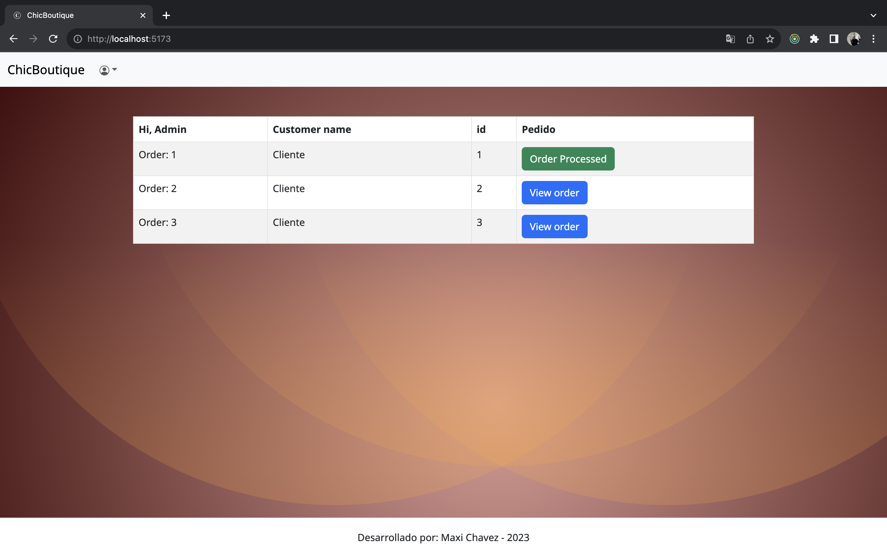

# Eccommerce con React + Vite + Typescript.

<details>
  <summary>Contenido 📝</summary>
  <ol>
    <li><a href="#objetivo-🎯">Objetivo</a></li>
    <li><a href="#sobre-el-proyecto-🔎">Sobre el proyecto</a></li>
    <li><a href="#deploy-🚀">Deploy</a></li>
    <li><a href="#stack">Stack</a></li>
    <li><a href="#instalación-en-local">Instalación</a></li>
    <li><a href="#vistas">Vistas</a></li>
    <li><a href="#futuras-funcionalidades">Futuras funcionalidades</a></li>
    <li><a href="#contribuciones">Contribuciones</a></li>
    <li><a href="#licencia">Licencia</a></li>
    <li><a href="#webgrafia">Webgrafia</a></li>
    <li><a href="#desarrollo">Desarrollo</a></li>
    <li><a href="#agradecimientos">Agradecimientos</a></li>
    <li><a href="#contacto">Contacto</a></li>
  </ol>
</details>

## Objetivo 🎯

El objetivo de este proyecto de Programación web es crear un ecommerce-moderno para una tienda virtual.

## Sobre el proyecto 🔎

En este proyecto, se ha utilizado Vite como herramienta de desarrollo, React como biblioteca para construir la interfaz y TypeScript como lenguaje de programación. Además, se ha implementado el patrón de arquitectura de datos Redux para una gestión eficiente del estado de la aplicación.

Para el renderizado dinámico de los datos, se ha utilizado programación asíncrona mediante la librería Axios para realizar solicitudes a la API externa "FakeStore Api". Esta API ofrece un catalago de articulos con informacion relevante del mismo y categorias.

Para la informacion de los usuarios (Admin y cliente) se utilizo un Json server, este mismo a posterior se le agrego la funcionalidad de recibir los pedidos emitidos por el cliente, el cliente a su vez puede visualizar los pedidos que realizo y el estado del mismo (si ya estan procesados o no)
El admin puede ver los pedidos de los clientes informacion de los productos renderizados dinamicamente, monto total, identificacion del pedido por id, tambien puede proceder a marcar el pedido como procesado.

Se ha dado especial énfasis tanto a la parte visual del proyecto como a la logica, y se ha implementado un buscador que permite a los usuarios encontrar los articulos de forma rápida y sencilla (el buscador usa debounce search).

El proyecto busca brindar una experiencia interactiva y atractiva para los usuarios que deseen comprar articulos por internet.

<!-- ## Deploy 🚀

<div align="center">
    <a href="https://www.google.com"><strong>Url a producción </strong></a>🚀🚀🚀
</div> -->

## Stack

<div align="center">
<a href="https://www.reactjs.com/">
    
</a>
<a href="https://www.typescriptlang.org/es/docs/handbook/">
    
</a>

 

  

   
 </div>

1. Clonar el repositorio
2. `$ npm install`
3. `$ npm run dev`
4. ...

## Vistas

Home

Home Responsive
  
Login

Login Responsive

Profile

Admin responsive
  
Carrito de compras

Ordenes Admin


Detail


User perfil

User perfil


## Futuras funcionalidades

✅ Backend
⬜ sincronizar registro con back y la api de google
⬜ Pagina de inicio - landing page moderna
⬜ ...

## Contribuciones

Las sugerencias y aportaciones son siempre bienvenidas.

Puedes hacerlo de dos maneras:

1. Abriendo una issue
2. Crea un fork del repositorio
   - Crea una nueva rama
     ```
     $ git checkout -b feature/nombreUsuario-mejora
     ```
   - Haz un commit con tus cambios
     ```
     $ git commit -m 'feat: mejora X cosa'
     ```
   - Haz push a la rama
     ```
     $ git push origin feature/nombreUsuario-mejora
     ```
   - Abre una solicitud de Pull Request

## Licencia

Este proyecto se encuentra bajo licencia de "Maxi Chavez"

## Webgrafia:

Para conseguir mi objetivo he recopilado información de:

- Ejemplos del Bootcamp
- Documentacion oficial.
- ...

## Herramientas para el desarrollo:

- https://css.glass/ => Para el efecto en el div que contiene el detalle.
- https://www.svgbackgrounds.com/ => Para el fondo de pantalla de ambas vistas.
- Utilice Mantine para un componente.
- Utilice bootstrap
- Utilice Json Server

## Testea la aplicacion con los siguientes usuarios

Administrador:

- Usuario: admin@gmail.com
- Contraseña: 1234567
  Cliente:
- Usuario: cliente@gmail.com
- Contraseña: 1234567

## Desarrollo:

```js
const developer = "MaxiChavez";

console.log("Desarrollado por: " + developer);
```

## Agradecimientos:

Agradezco a mis compañeros el tiempo dedicado a este proyecto.

- _Alvaro_
- **David**
- **_Francisco_**

## Contacto

<a href = "mailto:chavezmaxi@gmail.com"></a>
<a href="https://www.linkedin.com/in/maximiliano-chavez-b12877107/" target="_blank"></a>

</p>
